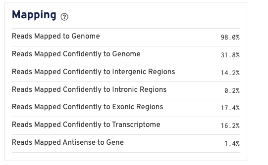

**Source file:**`results/qc/Col-0_v4_cellranger_web_summary.html`- ( which is the the Col-0 wild-type run against the custom reference `HPIv02_pFusionMYB41`)

| Estimated Number of Cells | 864 |
| ------------------------- | --- |

Fraction Reads in Cells - 23.0 %

**Summary**

Est number of cells : **864**

Mean reads per cell : **530, 829**

Meadian gene per cell : **998**

**Things to consider :**

1) High <u>Multimapping</u> -->   **66.2%** ,
2) mapping to intronic region is --> **0.2%** ( this was snRNA , dataset should have had high unspliced pre-mRNA with its introns)
3) mapping to intergenic --> 1**4.2%** ( 70% larger than intronic so reads are randomly aligning to unannotated regions)
4)
