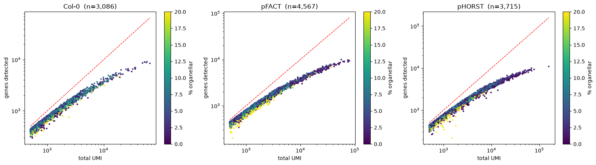
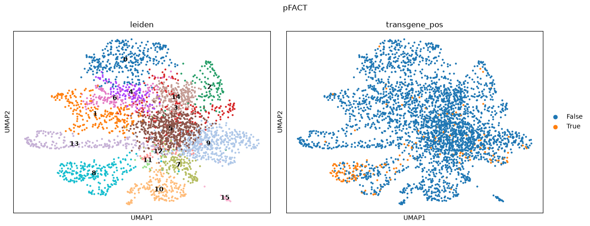
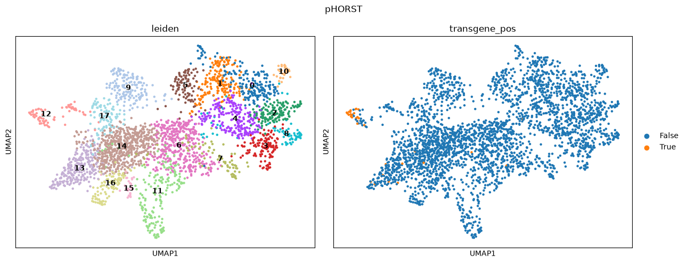
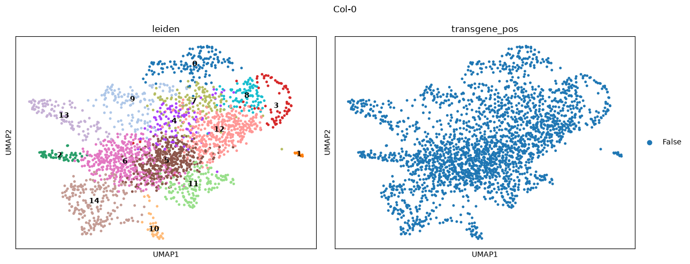

**Before Starting :**

Analysis of the Transgene Construct :

/data1/bfernando/DE_project/notebooks/01_compare_constructs_2.ipynb

**SAMPLES  :**

Col-0 (wild-type control), pFACT-MYB41, pHORST-MYB41.

##### **Initial Analysis :**

The two constructs are identical except for the promoter. Found in
[notebook 01](../notebooks/01_compare_constructs_2.ipynb):

- (notebook cells 8-9):  feature tables aligned side by side. Every annotated
  feature matches in coordinates and length between FACT and HORST *except* the
  promoter.
- (notebook cells 10-14):  comparison of the raw plasmid DNA, not just the
  labels. The single differing block is the promoter, "byte-for-byte identical"
  everywhere else including MYB41, the 3'UTR and both cloning scars.

**So any difference between pFACT and pHORST is attributable to promoter activity.**

**Scar 2** (contig 388-417) is validated in (notebook cells 15-17). It is the
cloning scar between the MYB41 gene end and its 3'UTR, and unlike Scar 1 it is
*transcribed* , so reads mapping to it can only come from the transgene.

It is identical in both constructs, which is why a single `pFusionMYB41` contig serves
as the reference for both.

**CUSTOM REFRENCE GENOME :**

## Custom reference

Built in [notebook 02](../notebooks/02_build_reference.ipynb).

**Genome:**

Col-0 HPIv02 + the `pFusionMYB41` transgene contig (1,866 bp) appended -> 8 sequences (Chr1-5, ChrC, ChrM, pFusionMYB41).

**Annotation:** the Araport11 GFF3 converted to GTF and merged with the contig GTF.

```bash
# --force-exons is REQUIRED: the Araport11 GFF3 has no exon features (only
# gene/mRNA/CDS/UTR), so ~3,824 CDS-only transcripts would get no exon line
# and mkref rejects the GTF.
gffread Athaliana.Col-0.HPIv02.gene.gff3 -T --force-exons \
  -o Athaliana.Col-0.HPIv02.gene.gtf

cat Athaliana.Col-0.HPIv02.gene.gtf Athaliana.Col-0.HPIv01.pFusionMYB41_only.gtf \
  > Athaliana.Col-0.HPIv02.plus_pFusionMYB41.gtf

cellranger mkref --genome=HPIv02_pFusionMYB41 \
  --fasta=Athaliana.Col-0.HPIv02.plus_pFusionMYB41.fasta \
  --genes=Athaliana.Col-0.HPIv02.plus_pFusionMYB41.gtf --nthreads=16
```

**The transgene is a separate gene from the endogenous copy:**

|                  | gene ID                     |
| ---------------- | --------------------------- |
| transgene        | `AT4G28110.Fusion`        |
| endogenous MYB41 | `AT4G28110.Araport11.447` |

Distinct IDs, so transgene and endogenous counts never mix despite sharing the
MYB41 coding sequence.

Totals: 27,655 Araport11 genes + 1 transgene =  **27,656** .

**Extra Notes :
 *`--force-exons`** — the first `mkref` failed with `GexReferenceError: 	Transcripts with no exons were detected`. Worth recording because anyone rebuilding this reference hits it.*

## Cell Ranger

`cellranger-10.1.0` at `/data1/bfernando/software/cellranger/cellranger-10.1.0`

### First run failed

    cellranger count --id=Col-0 ... --chemistry=SC3Pv3 ...

**54 cells, 1.2% valid barcodes.** Cause: the data is 3' v4 (GEM-X), not v3.
Both have R1 = 28 bp so read length gave no warning - only whitelist matching
identified it (78% v4 vs 0.5% v3).

Whitelist check: [notebook 03](../notebooks/03_raw_reads_qc.ipynb) (Step 5)

### Run of record

    cellranger count --id=Col-0_v4
    --transcriptome=reference/build/HPIv02_pFusionMYB41
    --fastqs=/data2/nhartwick/law_lab_myb41_scrna/rawreads
    --sample=Col-0
    --chemistry=auto
    --include-introns=true
    --create-bam=true --localcores=16 --localmem=64

`--sample=Col-0` matches the sample-name field in `{sample}_S{n}_L{lane}_{read}_001.fastq.gz`,
so only the 4 `Col-0_*` files were used. **Only Col-0 was run through Cell Ranger** -
the multimapping problem surfaced before the other two were processed.

Output: `Col-0_v4/outs/` (note: at the project root, not under `counts/`)

### Results - 864 cells

From `Col-0_v4/outs/metrics_summary.csv`. QC analysis in
[notebook 04](../notebooks/04_cellranger_count_qc.ipynb).

| metric                                 | value                         |
| -------------------------------------- | ----------------------------- |
| Reads                                  | 458,636,011                   |
| Reads mapped to genome                 | 98.0%                         |
| **Mapped CONFIDENTLY to genome** | **31.8%**               |
| - exonic / intronic / intergenic       | 17.4% /**0.2%** / 14.2% |
| Confidently to transcriptome           | **16.2%**               |
| Valid barcodes                         | 80.8%                         |
| Sequencing saturation                  | 76.4%                         |
| Estimated cells                        | 864                           |
| Fraction reads in cells                | **23.0%**               |
| Median genes per cell                  | 998                           |
| Median UMI per cell                    | 1,380                         |

### Three problems

1. **~66% multimapping.** 98.0% align to the genome but only 31.8% uniquely. Cell Ranger discards the difference.
2. **Intronic = 0.2%.** Unexpectedly low for single-nucleus data, where unspliced pre-mRNA should contribute substantially.
3. **23% reads in cells.** 10x flags <70% as high ambient RNA.

### Cell calling was unreliable

The barcode-rank plot has **no knee** — a smooth diagonal with no cliff separating cells
from background, so the cell estimate is unreliable per 10x. Measured overlap: lowest
*called* cell 502 UMIs, highest *rejected* barcode 5,153 UMIs.

Plot: `results/qc/Col-0_barcode_rank_forceN.png` ·
analysis in [notebook 04](../notebooks/04_cellranger_count_qc.ipynb) (Steps 2-4) ·
method detail in [notes/04](../notes/04_cellranger_cell_calling.md)

Tested `--force-cells` (via `reanalyze`, which reuses the raw matrix):

| run                  | cells | med UMI | med genes | med % organellar | total genes |
| -------------------- | ----- | ------- | --------- | ---------------- | ----------- |
| default (EmptyDrops) | 864   | 1,379   | 997       | 3.8              | 20,547      |
| force-cells 2000     | 2,000 | 1,034   | 783       | 5.3              | 20,939      |
| force-cells 3000     | 3,000 | 772     | 611       | 5.3              | 21,095      |

**Rejected 3000 - kept 864 and 2000, and decided to quantify using alvinfry** Tripling the cell count added 548 genes (+2.7%) while median
UMI fell 44% and median genes 39%. The extra barcodes contain the same ambient RNA the
called cells already sample.

Detail: [notes/03](../notes/03_cellranger_workflow.md)

**-> The 66% multimapping is what prompted moving to alevin-fry.**

## Read Stats :

Before switching tools: the 66% multimapping needed diagnosing.

`samtools idxstats` on the Cell Ranger BAM, normalised by chromosome length.
Calculation in [notebook 06](../notebooks/06_are_these_snRNA_data_why_inflatedChrC_ChrM.ipynb).

```bash
samtools idxstats Col-0_v4/outs/possorted_genome_bam.bam
```

| ref            | reads/kb | vs baseline      | % of mapped reads |
| -------------- | -------- | ---------------- | ----------------- |
| Chr1           | 602.7    | 1.0x             | 4.1%              |
| **Chr2** | 7,417.6  | **12.4x**  | **32.5%**   |
| **Chr3** | 9,288.0  | **15.5x**  | **48.5%**   |
| Chr4           | 583.0    | 1.0x             | 2.4%              |
| Chr5           | 609.4    | 1.0x             | 3.7%              |
| **ChrC** | 22,631.5 | **37.8x**  | 0.8%              |
| **ChrM** | 99,191.8 | **165.8x** | **8.1%**    |
| pFusionMYB41   | 35.9     | 0.06x            | ~0%               |

Chr1, Chr4 and Chr5 independently agree at ~600 reads/kb, so considering that as a baseline.
Subtracting it from the other four chrs.

```
Chr2 : 19698.3 x 600.3 = 11.8M
Chr3 : 23459.8 x 600.3 = 14.1M
ChrM :   366.9 x 600.3 =  0.22M
ChrC :   154.5 x 600.3 =  0.09M
```

```
Chr2   146.1M observed  -  11.8M expected  =  134.3M excess
Chr3   217.9M observed  -  14.1M expected  =  203.8M excess
ChrC     3.5M observed  -   0.09M expected =    3.4M excess
ChrM    36.4M observed  -   0.22M expected =   36.2M excess
                                              ─────────────
                                               377.7M excess

377.7M / 458,636,011  =  82.3% of the library
```

 **377.7M excess reads = 82.3% of the library**.
Chr2 + Chr3 + ChrM alone hold **89% of all mapped reads**.

    samtools idxstats Col-0_v4/outs/possorted_genome_bam.bam

**Interpretation:** reads are concentrated in a few loci, not scattered.

Consistent with rDNA (TAIR10 carries only collapsed 45S arrays, so reads from every genomic copy pile
onto the few assembled ones) plus organellar rRNA.

Cause: the oligo-dT capture that should enrich polyadenylated mRNA underperformed, so non-polyadenylated RNA came through.

### It is rRNA, not organelles

Same library, counted two ways ([notebook 06](../notebooks/06_are_these_snRNA_data_why_inflatedChrC_ChrM.ipynb)):

|      | reads (genome) | %     | gene UMIs | %               |
| ---- | -------------- | ----- | --------- | --------------- |
| Chr1 | 18,338,962     | 4.1%  | 4,050,842 | **23.0%** |
| Chr2 | 146,114,338    | 32.5% | 2,882,036 | 16.4%           |
| Chr3 | 217,895,296    | 48.5% | 3,470,278 | 19.7%           |
| Chr4 | 10,835,887     | 2.4%  | 2,385,493 | 13.6%           |
| Chr5 | 16,438,079     | 3.7%  | 3,961,160 | 22.5%           |
| ChrC | 3,496,063      | 0.8%  | 291,636   | **1.7%**  |
| ChrM | 36,395,838     | 8.1%  | 550,989   | **3.1%**  |

Chr2 + Chr3 go from **81% of reads to 36% of UMIs**; ChrM from 8.1% to 3.1%. Those reads
align to genomic DNA but are not annotated genes, so they never become counts.

Chloroplast and mitochondrial genes account for only **4-6% of UMIs** in cell-like barcodes. psbA and rbcL, the two most abundant chloroplast transcripts, which would dominate if chloroplasts were present : sit at **0.05% and 0.02%**.

The droplets do not contain organelles. The high ChrC/ChrM read counts are organellar **rRNA** in the ambient soup, which is unannotated and therefore never becomes a gene count.

Organellar fractions and the psbA/rbcL check:
[notebook 06](../notebooks/06_are_these_snRNA_data_why_inflatedChrC_ChrM.ipynb).
Gene names confirmed from the reference's own `gene_id_to_name.tsv`
(`ATCG00020` = PSBA, `ATCG00490` = RBCL).

---

## ALEVIN-FRY

Full command log: [notes/01](../notes/01_Notes_2run_lowmapping_comformed.md)

Cell Ranger discards multimapped reads outright. alevin-fry can instead resolve
them statistically (`cr-like-em`). Given 66% of reads were multimapping, that was worth
testing.

**Environment** `/data1/bfernando/conda_envs/alevinfry` — piscem 0.21.1, alevin-fry 0.16.2,
pyroe 0.9.0

> Used **piscem, not salmon.** The alevin-fry github page specified this.

### 1. Splici reference (`pyroe`)

alevin-fry maps against a **transcriptome**, not the genome, so the Cell Ranger `mkref`
reference cannot be reused. And because this is single-*nucleus* data, the reference needs
intronic sequence too, the nuclear RNA is largely unspliced pre-mRNA. Hence **splici**
(spliced + intronic).

The merged GTF first needed cleaning: **5 lines contain no tab characters** (4 AGAT header
lines plus 1 blank), because the merge used `cat araport.gtf contig.gtf`, which put the contig file's header block in the middle. `mkref` tolerated them; pyranges does not (`'float' object has no attribute 'rstrip'`).

```bash
awk 'BEGIN{FS=OFS="\t"}
     /^#/ {next}
     NF<9 {next}
     $3=="mRNA" {$3="transcript"}
     $3=="gene" || $3=="transcript" || $3=="exon" {print}' \
  reference/build/Athaliana.Col-0.HPIv02.plus_pFusionMYB41.gtf \
  > alvinfry/splici_input.gtf

pyroe make-splici \
  reference/build/Athaliana.Col-0.HPIv02.plus_pFusionMYB41.fasta \
  alvinfry/splici_input.gtf \
  90 \
  alvinfry/splici_HPIv02_pFusionMYB41
```

`90` = R2 length, used to size the flanks added around intron boundaries. Default flank
trim is 5, hence the `fl85` filenames.

**Outputs:** `splici_fl85.fa` — **98,998 sequences** (48,458 spliced + 50,540 intronic) ·
`splici_fl85_t2g_3col.tsv` — maps each sequence to its gene and splice status (S/U/A)

Transgene confirmed present in both forms:

```
AT4G28110.Fusion.1   AT4G28110.Fusion   S
AT4G28110.Fusion.2   AT4G28110.Fusion   S
AT4G28110.Fusion-I   AT4G28110.Fusion   U
```

### 2. Index (`piscem build`)

```bash
piscem build \
  -s alvinfry/splici_HPIv02_pFusionMYB41/splici_fl85.fa \
  -o alvinfry/piscem_splici_idx -t 16 -w alvinfry/piscem_workdir
```

Chops every sequence into 31-mers and builds a compacted de Bruijn graph + `sshash` index.
620,779 unitigs, 85.3 Mb — built once, reused for all three samples.

### 3. Map to RAD (`piscem map-sc`)

```bash
piscem map-sc \
  -i alvinfry/piscem_splici_idx \
  -g '1{b[16]u[12]x:}2{r:}' \
  -1 <sample>_R1_001.fastq.gz -2 <sample>_R2_001.fastq.gz \
  -o alvinfry/<sample>_map -t 16
```

Geometry `1{b[16]u[12]x:}2{r:}` = from R1 take 16 bp barcode + 12 bp UMI, discard the rest;
R2 is the cDNA. Confirmed in the log as `Protocol: custom (bc_len=16, umi_len=12)`.

**RAD** = Reduced Alignment Data — barcode, UMI, and which sequences the read hit. No
sequences or coordinates, which is why it is 1.7 GB against the BAM's 18 GB. Crucially it
**keeps multimapping reads** rather than discarding them, so the resolution strategy can be
chosen later.

### 4-6. Permit list, collate, quantify

```bash
zcat .../cellranger-10.1.0/lib/python/cellranger/barcodes/3M-3pgex-may-2023_TRU.txt.gz \
  > alvinfry/3M-3pgex-may-2023_TRU.txt          # 3,686,400 barcodes

alevin-fry generate-permit-list -i alvinfry/<s>_map -d fw \
  --unfiltered-pl alvinfry/3M-3pgex-may-2023_TRU.txt -o alvinfry/<s>_quant

alevin-fry collate -i alvinfry/<s>_quant -r alvinfry/<s>_map -t 16

alevin-fry quant -i alvinfry/<s>_quant \
  -m alvinfry/splici_HPIv02_pFusionMYB41/splici_fl85_t2g_3col.tsv \
  -t 16 -r cr-like-em -o alvinfry/counts_cr-like-em/<s>
```

> **Deviation from the tutorial:** it downloads `10x_v2_permit.txt` — the **v2** whitelist.
> Our data is v4. Using the tutorial's file would have reproduced the 54-cell Cell Ranger
> Used Cell Ranger's v4 list instead.

`--unfiltered-pl` validates barcodes against the whitelist (exact match, or 1-edit
correction) but applies **no cell calling** — it keeps everything with >= 10 reads.

### Results

| sample | mapped      | of total reads | **mapping rate** |
| ------ | ----------- | -------------- | ---------------------- |
| Col-0  | 88,187,028  | 458,636,011    | **19.23%**       |
| pFACT  | 120,967,081 | 515,030,568    | **23.49%**       |
| pHORST | 118,409,183 | 501,163,357    | **23.63%**       |

All three in a 19-24% band, so **the low mapping is systematic across the prep, not one
bad library**.

**This independently confirms the rRNA diagnosis:**

| method                       | evidence                             | "not usable"    |
| ---------------------------- | ------------------------------------ | --------------- |
| idxstats density subtraction | where reads land on chromosomes      | **82.3%** |
| piscem splici mapping        | do reads match annotated transcripts | **80.8%** |

Within 1.5 percentage points, from completely different evidence, on the same library
(read totals identical).

**What the switch gained:**

|                                            | usable reads   |
| ------------------------------------------ | -------------- |
| Cell Ranger (confidently -> transcriptome) | 16.2% = 74.3M  |
| alevin-fry + splici                        | 19.23% = 88.2M |

**+13.9M reads, ~19% more usable data.** Real, but it does not change the shape of the
problem — the dominant loss is rRNA, which no quantifier recovers.

**`cr-like` vs `cr-like-em`** (the actual multimapping recovery, same collated RAD,
minutes to rerun):

| sample | cr-like    | cr-like-em | gain            |
| ------ | ---------- | ---------- | --------------- |
| Col-0  | 17,592,435 | 18,123,357 | **+3.0%** |
| pFACT  | 29,005,632 | 29,835,121 | **+2.9%** |
| pHORST | 21,357,843 | 21,889,175 | **+2.5%** |

~3% across all three. Small, and exactly what the rRNA finding predicts: the 66%
multimapping was never mostly gene-level ambiguity, so EM has little to recover.

Counts used downstream: `alvinfry/counts_cr-like-em/<sample>/alevin/`

---

## CELL CALLING / FILTERING

Detail: [notes/02](../notes/02_cell_calling_alevinfry.md) ·
code: [notebook 07](../notebooks/07_scanpy_analysis.ipynb)

The counts matrices are **barcode x gene**, not cell x gene.

A barcode identifies an**droplet**, and most droplets never caught a nucleus, they still get a barcode and still
capture ambient RNA. `--unfiltered-pl` deliberately does no cell calling, so the matrices
start at 192,259 / 200,283 / 193,477 barcodes.

### Three methods, three answers

| method                                  | cells (Col-0)     | note                                                       |
| --------------------------------------- | ----------------- | ---------------------------------------------------------- |
| Cell Ranger EmptyDrops                  | **864**     | median 1,380 UMI                                           |
| alevin-fry`-k` (knee)                 | **152,757** | median**68** UMI. which is  not nuclei             |
| DropletUtils emptyDrops (`lower=100`) | **5,068**   | minimum exactly 101 UMI, i.e. the parameter set the answer |

The knee method failed because **there is no knee,** the barcode-rank curve is a smooth
diagonal from rank 1 to ~10^5 in all three samples.

A UMI-count histogram shows two peaks (1 UMI, and 40-100 UMI) but **no peak where cells should be** they sit in an unstructured tail. Two independent tools now confirm the same pathology.

**Consequence: no threshold is data-derived.** Any cutoff is a judgement call, and that is a property of this library rather than a shortcoming of the analysis.

### Where the cells are

Barcodes binned by UMI count ([notebook 07](../notebooks/07_scanpy_analysis.ipynb), cell 6):

| UMI range               | Col-0           | pFACT           | pHORST          |
| ----------------------- | --------------- | --------------- | --------------- |
| 0 - 10                  | 41,041          | 46,555          | 44,636          |
| 10 - 50                 | 11,136          | 550             | 86,864          |
| 50 - 100                | 109,621         | 47,277          | 42,701          |
| 100 - 500               | 27,101          | 101,132         | 15,284          |
| **500 - 1,000**   | **1,848** | **2,794** | **1,632** |
| **1,000 - 5,000** | **1,081** | **1,423** | **1,485** |
| **5,000+**        | **157**   | **350**   | **598**   |
| **total > 500**   | **3,086** | **4,567** | **3,715** |

### The 500 cutoff is where the data changes character

**Table below plots UMI per gene** is the direct test of whether a barcode holds a real transcriptome:

- **~1.0** — every molecule is a different gene. A random scoop of soup, sampled so
  sparsely you never hit the same gene twice.
- **>1.5** — genes detected repeatedly, which is what a real cell looks like.

| UMI range               | Col-0          | pFACT          | pHORST         |
| ----------------------- | -------------- | -------------- | -------------- |
| 0 - 10                  | 1.00           | 1.00           | 1.00           |
| 10 - 50                 | 1.04           | 1.03           | 1.05           |
| 50 - 100                | 1.06           | 1.05           | 1.05           |
| 100 - 500               | 1.10           | 1.06           | 1.11           |
| **500 - 1,000**   | **1.28** | **1.26** | **1.30** |
| **1,000 - 5,000** | **1.49** | **1.53** | **1.54** |
| **5,000+**        | **2.56** | **2.82** | **2.62** |

Flat at ~1.0-1.1 through every bin below 500, then it climbs: 1.3 -> 1.5 -> 2.6.
**The transition happens exactly at the 500 boundary, and identically in all three
samples.**

Median genes detected in the retained bins:

| UMI range     | Col-0 | pFACT | pHORST |
| ------------- | ----- | ----- | ------ |
| 500 - 1,000   | 513   | 508   | 510    |
| 1,000 - 5,000 | 1,021 | 1,038 | 1,135  |
| 5,000+        | 3,394 | 4,018 | 3,672  |

(min / max per bin in [notebook 07](../notebooks/07_scanpy_analysis.ipynb))

Library-wide the median is **64 UMI / 61 genes** — a ratio of 1.05, so the bulk of
barcodes are ambient by this measure.



```python
MIN_COUNTS = 500          # justified by the table above and the saturation curve
MAX_ORGANELLAR = 10       # percent
# min_genes dropped - nothing in the >500 population falls below ~400 genes,
# so the filter removed zero barcodes
```

| sample | barcodes | pass >500 UMI | **pass all** | removed by organellar |
| ------ | -------- | ------------- | ------------------ | --------------------- |
| Col-0  | 192,259  | 3,086         | **2,442**    | 644 (21%)             |
| pFACT  | 200,283  | 4,567         | **3,304**    | 1,263 (28%)           |
| pHORST | 193,477  | 3,715         | **2,937**    | 778 (21%)             |

The organellar filter is doing real work,  it removes a fifth to a quarter of the
UMI-passing barcodes. pFACT loses the most, consistent with its heavier ambient load.

| sample | cells | median UMI | median genes |
| ------ | ----- | ---------- | ------------ |
| Col-0  | 2,442 | 843        | 636          |
| pFACT  | 3,304 | 796        | 619          |
| pHORST | 2,937 | 1,261      | 892          |

For comparison, Cell Ranger called 864 cells at 998 median genes — so this is **~3x more
cells at ~60% the depth each**. 600-900 genes/cell is thin for plant cell-type annotation
but workable.

---

## CLUSTERING

Code: [notebook 07](../notebooks/07_scanpy_analysis.ipynb)

Each sample clustered **separately**, so cluster numbers are not comparable across samples.

```python
adata.layers["counts"] = adata.X.copy()   # keep raw before anything overwrites .X
adata.X.data = np.round(adata.X.data)     # cr-like-em gives fractional counts

sc.pp.normalize_total(adata, target_sum=1e4)   # depth, not transcript length -
sc.pp.log1p(adata)                             # UMIs already handle length
adata.raw = adata

sc.pp.highly_variable_genes(adata, n_top_genes=10000)
adata = adata[:, adata.var["highly_variable"]].copy()

sc.pp.scale(adata, max_value=10)
sc.tl.pca(adata, n_comps=50, svd_solver="arpack")
sc.pp.neighbors(adata, n_neighbors=15, n_pcs=30)
sc.tl.leiden(adata, resolution=1.0, flavor="igraph", n_iterations=2)
sc.tl.umap(adata)
```

| sample | cells | clusters |
| ------ | ----- | -------- |
| Col-0  | 2,442 | 15       |
| pFACT  | 3,304 | 16       |
| pHORST | 2,937 | 18       |

The UMAPs show clearly separated structure — distinct lobes and several well-isolated
islands — including in Col-0. So **~600-900 genes per cell is enough to resolve cell types
here**, which was an open question given the depth.

> `n_top_genes=10000` is higher than the usual 2,000. It produced usable clusters, so it
> was not revisited, but it is worth noting as a parameter that was not tuned.

---

## TRANSGENE DETECTION AND LOCALISATION

Counts: [notebook 05](../notebooks/05_transgene_umi_counts.ipynb) ·
clustering and localisation: [notebook 07](../notebooks/07_scanpy_analysis.ipynb)

### Detection

Threshold is **>= 1 UMI**, not > 0. `cr-like-em` assigns fractional counts, and Col-0 shows
4 barcodes with sub-1 fractions and **zero** with a whole UMI,  so the wild-type control
derives the cutoff rather than convention setting it.

| sample     | cells | transgene >= 1 UMI | % of cells |
| ---------- | ----- | ------------------ | ---------- |
| Col-0 (WT) | 2,442 | **0**        | 0%         |
| pFACT      | 3,304 | **198**      | 6.0%       |
| pHORST     | 2,937 | **34**       | 1.2%       |

**Check 1 — it is not ambient.** If transgene RNA were only empty droplets and real
cells would carry it at the same rate.

|        | all barcodes (>=1) | rate    | cells (>=1) | rate  | enrichment     |
| ------ | ------------------ | ------- | ----------- | ----- | -------------- |
| Col-0  | 1 / 192,259        | 0.0005% | 0 / 2,442   | 0%    | —             |
| pFACT  | 1,230 / 200,283    | 0.61%   | 198 / 3,304 | 5.99% | **~10x** |
| pHORST | 107 / 193,477      | 0.055%  | 34 / 2,937  | 1.16% | **~21x** |

Filtering removed ~84% of transgene-positive barcodes in pFACT (1,230 -> 198). Those were
empty droplets holding ambient transgene RNA.

### Localisation







|                  | cluster      | positive | cells | in-cluster rate | rate elsewhere | enrichment    |
| ---------------- | ------------ | -------- | ----- | --------------- | -------------- | ------------- |
| **pFACT**  | **8**  | 98       | 241   | **40.7%** | 3.1%           | **13x** |
| **pHORST** | **12** | 21       | 73    | **28.8%** | 0.45%          | **64x** |

total transgene positive cells in pFACT = 193

total transgene positive cells in pHORST = 34

pFACT cluster 8 holds **98 of 193 positive cells — half of them — in 7% of the data**.
pHORST cluster 12 holds **21 of 34 (62%) in 2.5%**. Next highest in either sample is 8.3%.

### Both constructs target the same cell population

The two clusters share **15 of their top 25 markers** (out of 27,656 genes):

| gene      | name           | pFACT cl8 logFC | pHORST cl12 logFC |
| --------- | -------------- | --------------- | ----------------- |
| AT3G44550 | **FAR5** | 6.14            | **8.08**    |
| AT5G09480 | —             | 4.98            | 6.14              |
| AT2G38380 | —             | 4.79            | 6.06              |
| AT2G48130 | —             | 4.63            | 6.21              |
| AT1G55330 | AGP21          | 5.16            | 5.58              |
| AT2G18370 | —             | 5.33            | 5.40              |
| AT2G23540 | —             | 3.94            | 6.18              |
| AT4G38080 | —             | 4.20            | 5.76              |
| AT5G09530 | PELPK1         | 4.73            | 5.09              |
| AT3G32980 | —             | 4.34            | 4.98              |
| AT1G08510 | **FATB** | 4.58            | 4.46              |
| AT4G20260 | PCAP1          | 3.45            | 4.48              |
| AT1G72510 | —             | 3.91            | 3.48              |
| AT2G22470 | AGP2           | 3.84            | 3.28              |
| AT4G09030 | AGP10          | 3.55            | 3.11              |
